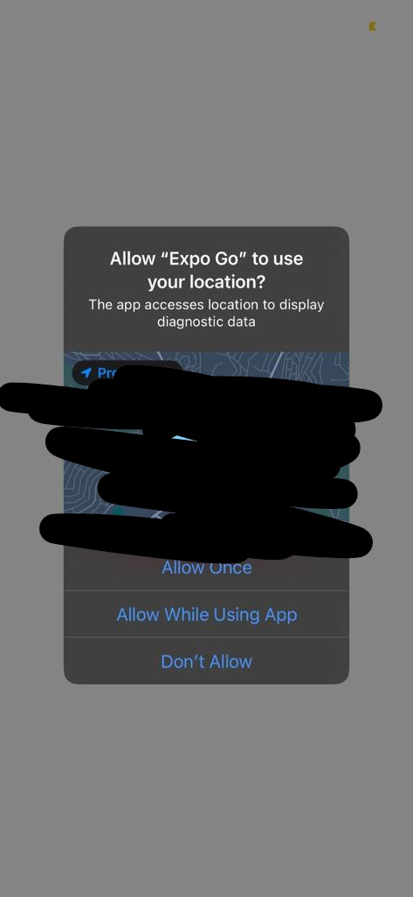
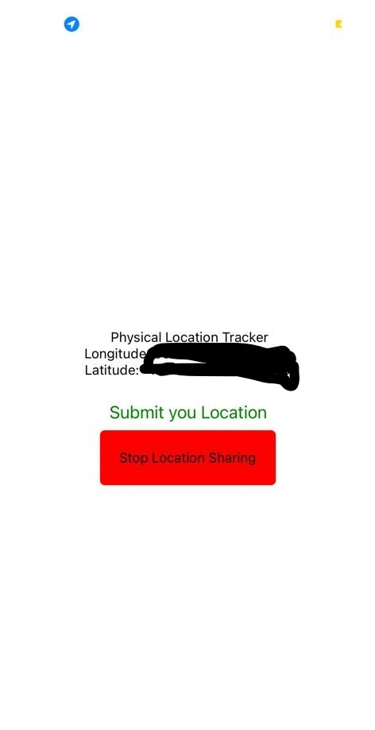

# gps_dApp

This react-native app will prompt a user for location sharing. This information will be used to design a smart contract based on physical presence of one party.
i.e., one party get rewarded for being in certain area based on the agreement abetween both parties

App requesting sharing location permission:

When Agreed, and you submit your location:

